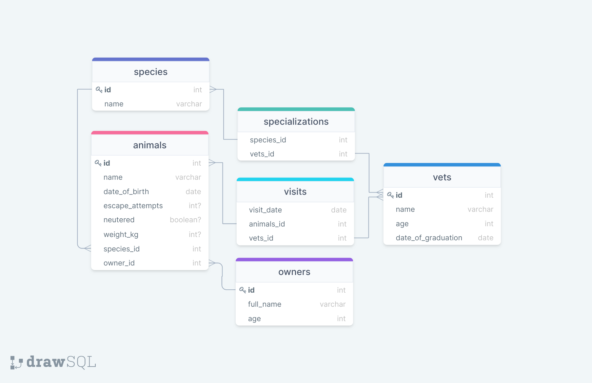

# Vet Clinic Database

PostgreSQL Database for a Vet Clinic.

## Getting Started

This repository includes files with plain SQL that can be used to recreate a database:

- Use [schema.sql](./schema.sql) to create all tables.
- Use [data.sql](./data.sql) to populate tables with sample data.
- Check [queries.sql](./queries.sql) for examples of queries that can be run on a newly created database. **Important note: this file might include queries that make changes in the database (e.g., remove records). Use them responsibly!**

## Author

👤 **Piero Lescano**

- GitHub: [@piero-vic](https://github.com/piero-vic)
- Twitter: [@v1ccenzo](https://twitter.com/v1ccenzo)
- LinkedIn: [piero-lescano](https://linkedin.com/in/piero-lescano)

## 🤝 Contributing

Contributions, issues, and feature requests are welcome!

Feel free to check the [issues page](../../issues/).

## Show your support

Give a ⭐️ if you like this project!
